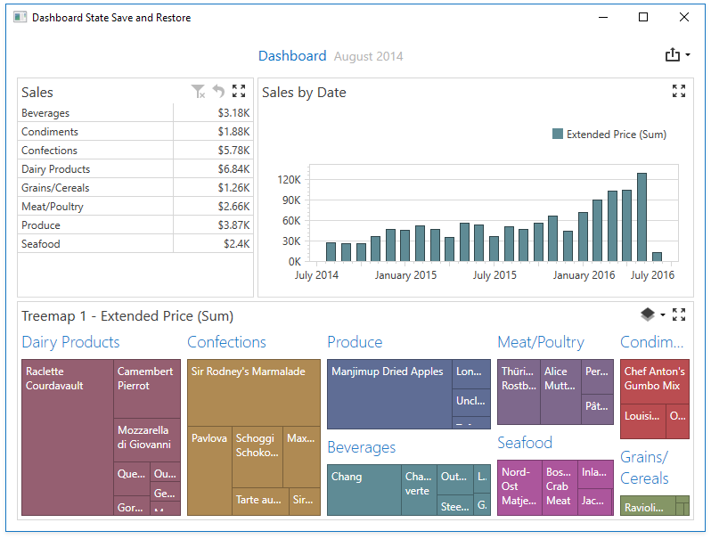

<!-- default badges list -->

<!-- default badges end -->

# Dashboard for WPF - How to Set the Initial Dashboard State

This example demonstrates how to manage dashboard state to save and restore selected master filters values, current drill-down levels and other parameters such as Treemap layers.

When the main window closes, the [DashboardControl.GetDashboardState](https://docs.devexpress.com/Dashboard/DevExpress.DashboardWpf.DashboardControl.GetDashboardState) obtains a dashboard state object. It is serialized to XML and added to the **XElement** object stored  stored in the [CustomProperties](https://docs.devexpress.com/Dashboard/DevExpress.DashboardCommon.Dashboard.CustomProperties) collection. Subsequently the dashboard with the dashboard state data is saved to a file.

When the application starts, the DashboardControl loads the dashboard and the [DashboardState](https://docs.devexpress.com/Dashboard/DevExpress.DashboardCommon.DashboardState) object is deserialized and restored using the **GetDataFromString** method in the [DashboardControl.SetInitialDashboardState](https://docs.devexpress.com/Dashboard/DevExpress.DashboardWpf.DashboardControl.SetInitialDashboardState) event handler.

<!-- default file list -->
## Files to Review

* [MainWindow.xaml.cs](./CS/WpfDashboard_DashboardState/MainWindow.xaml.cs) (VB: [MainWindow.xaml.vb](./VB/WpfDashboard_DashboardState/MainWindow.xaml.vb))
* [MainWindow.xaml](./CS/WpfDashboard_DashboardState/MainWindow.xaml) (VB: [MainWindow.xaml](./VB/WpfDashboard_DashboardState/MainWindow.xaml))
<!-- default file list end -->

## Documentation

- [Manage Dashboard State](https://docs.devexpress.com/Dashboard/400144/wpf-viewer/manage-dashboard-state)

## More Examples

* [Dashboard for Web Forms - How to specify a default dashboard state in code](https://github.com/DevExpress-Examples/aspxdashboard-how-to-specify-a-default-dashboard-state-in-code-t513681)
* [Dashboard for MVC - How to specify a default dashboard state in code](https://github.com/DevExpress-Examples/aspnet-mvc-dashboard-how-to-specify-a-default-dashboard-state-in-code-t586607)
* [Dashboard for ASP.NET Core - How to specify a default dashboard state in code](https://github.com/DevExpress-Examples/aspnet-core-dashboard-control-how-to-specify-a-default-dashboard-state-in-code-t607138)
* [Dashboard for WinForms - How to Save and Restore the Dashboard State](https://github.com/DevExpress-Examples/winforms-dashboard-save-restore-dashboard-state)
